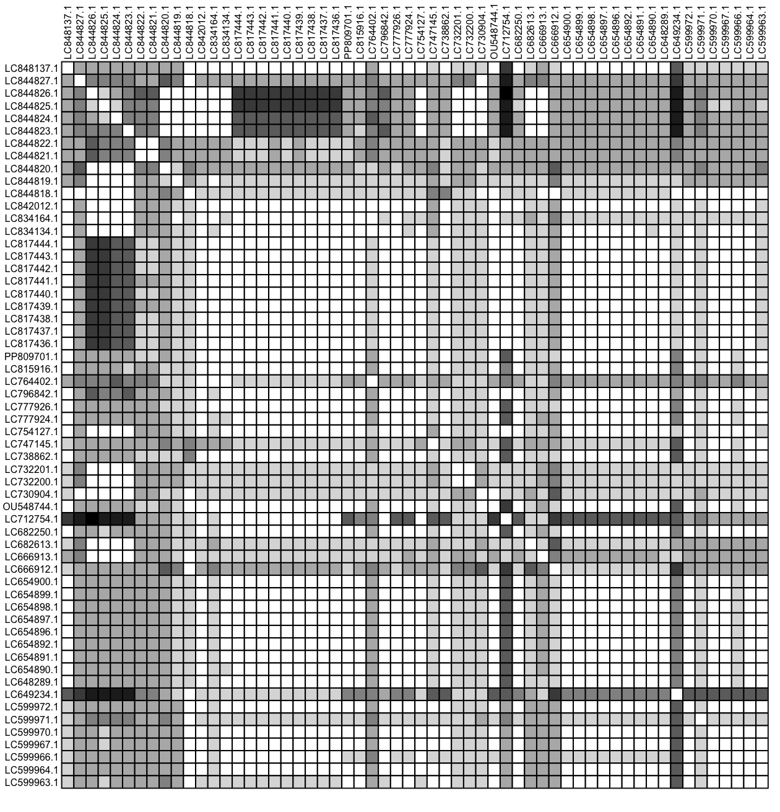
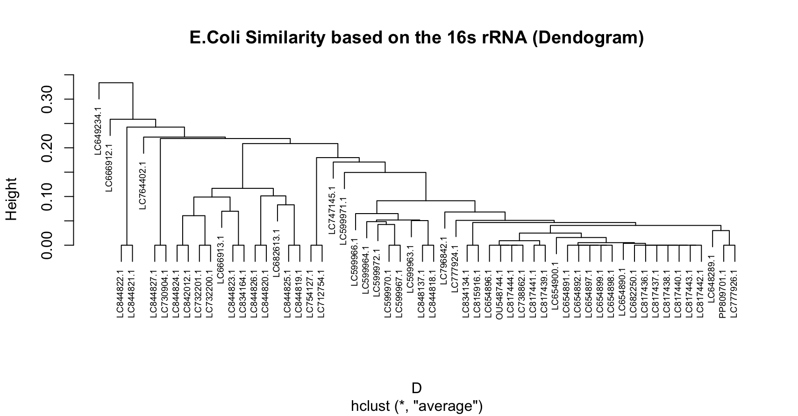
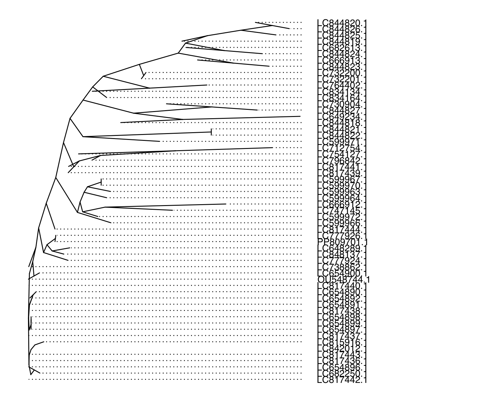
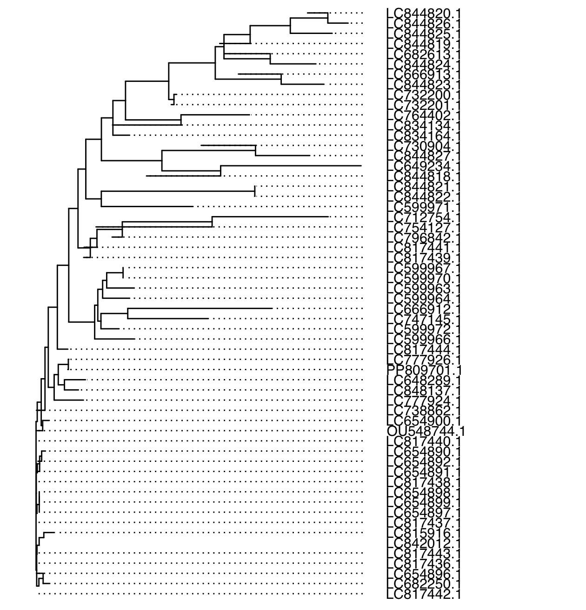
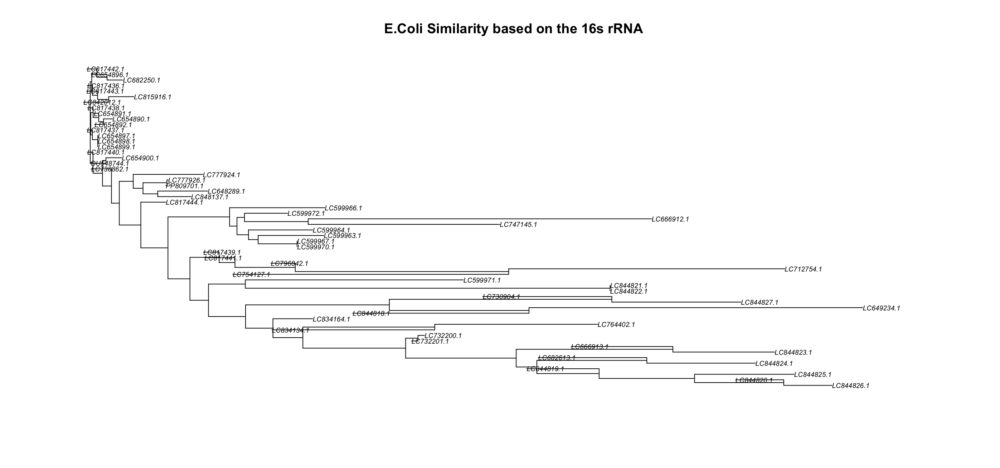

# Antimicrobial Resistance: An R Data Science Analysis

## Table of Contents

## Antimicrobial Resistance/ Introduction

A current pressing real-world issue is Antimicrobial resistance (AMR). AMR occurs due to the quick evolutionary nature of bacteria, allowing them to render antibodies ineffective, which threatens our modern medicine and healthcare. An example of this is the bacteria Methicillin-resistant Staphylococcus aureus (MRSA) from the 1960s. Originally treatable with common antibiotics such as methicillin and penicillin, the misuse of MRSA led to it developing resistance. As a result, MRSA is now more challenging to treat and poses dangers to immunocompromised patients. The problem of AMR impacts the whole world and is exacerbated by the widespread misuse of antibiotics and the lack of awareness of the severe issue of AMR. In this data science/bioinformatics project, I try to address this issue by utilizing online tools and algorithms.

## Technologies/Tools

## Phylogenetic Tree

I utilized a phylogenetic tree to trace the evolution of various Escherichia coli strains. I got data from the NCBI blast tool and took various genomes of the S16 rRNA. I annotated the genomes and then did sequence alignment to determine how related different strains were. Finally, I created a distance matrix and plotted the results with various visualizations of a phylogenetic tree. This analysis is important because understanding the evolutionary pathways of bacteria helps us anticipate changes that might impact treatment's effectiveness and public health strategies.

I first used NCBI an seared for the Escherichia coli 16S rRNA gene in different strains

Then I processed these into an R fasta file using the ape package

then I saved it as a .txt file and annotated it with the corresponding strain name

I used several packages to align the sequences and view the sequence alignment

#### Results

sequence alignment

{width="354"}

distance matrix heat map

{width="387"}

Phylogenetic trees

{width="398"}

{width="367"}

{width="283"}

{width="401"}
